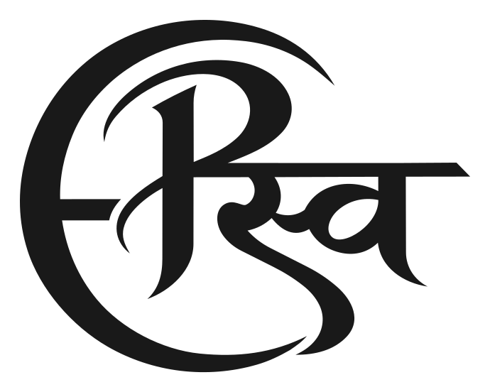

<p align="center">
  <picture>
    <source media="(prefers-color-scheme: dark)" srcset="public/brand/signature-white.svg">
    <source media="(prefers-color-scheme: light)" srcset="public/brand/signature-black.svg">
    
  </picture>
</p>

# Pranav Swaroop Gundla — Portfolio

Connecting glioma histology with spatial biology through deep learning.

Personal research portfolio featuring computational pathology, spatial biology, publications, open-source contributions, photography, and side projects.

[Visit the portfolio](https://psgundla.com) · [CV](public/CV-Pranav-Swaroop-Gundla.pdf)

## Current experience

- Signature logo reveal that transitions into the header, with reduced-motion support.
- Light theme on every page load; an optional dark theme with matching logo assets.
- Editorial typography and a red accent, with Liquid Glass-inspired navigation and controls.
- Full-width research notebook with project details and publication links.
- Publications, conferences, awards, and an interactive research toolkit.
- GitHub activity across the full section below 1440px; repository cards on larger screens.
- Photography, the BUNKER browser sequencer, social posts, and a vinyl-style music player.
- Destination links open in new tabs. Section navigation stays on-page; email uses the mail client.

GitHub activity and repository statistics are dated snapshots, not live API data. Research descriptions and publication status are maintained in source.

## Run locally

Use Node.js 20.19+ or 22.12+ and npm.

```sh
npm ci
npm run dev -- --host 127.0.0.1 --port 4174
```

Open http://127.0.0.1:4174/.

## Validate and build

```sh
npm test
npm run lint
node tests/signature-loader.mjs
npm run build
npm run preview
```

`npm test` runs the portfolio render smoke checks. Signature-loader checks cover animation lifecycle and fallbacks. Browser interaction and visual checks are separate; these commands do not establish device-level accessibility compliance.

Production output is written to `dist/`. `npm run deploy` currently builds production assets only; it does not publish them.

## Source map

| Path | Purpose |
| --- | --- |
| `src/App.jsx` | Main portfolio and theme state |
| `src/components/` | Navigation, research, publications, toolkit, and social components |
| `src/data/portfolio.js` | Research projects, publications, and photos |
| `src/components/GitHubContributions.jsx` | Dated GitHub activity and repository snapshot |
| `src/styles/Editorial.css` | Editorial theme, glass materials, and responsive overrides |
| `src/styles/TechnicalStack.css` | Toolkit keys and tooltip |
| `public/brand/signature-*.svg` | Static and animated signature logos |
| `public/brand/signature-icons/` | Favicon, touch, and maskable icons |
| `public/coffee-loader.css`, `public/coffee-loader.js` | Signature loader; legacy filenames retained |
| `public/bunker/` | Standalone techno sequencer |
| `tests/` | Smoke and interaction checks |

## Branches

- `master`: current portfolio with full-width Research focus.
- `psgundlacod/research-pair-next-update`: saved working draft before restoring the full-width layout. Includes the reserved left panel beside Research focus and other draft files present at snapshot time. It is a future-work snapshot, not a release branch.

## Stack

React 19, Vite 7, Motion, React Icons, and CSS. Fonts are bundled locally through Fontsource and portfolio assets.
